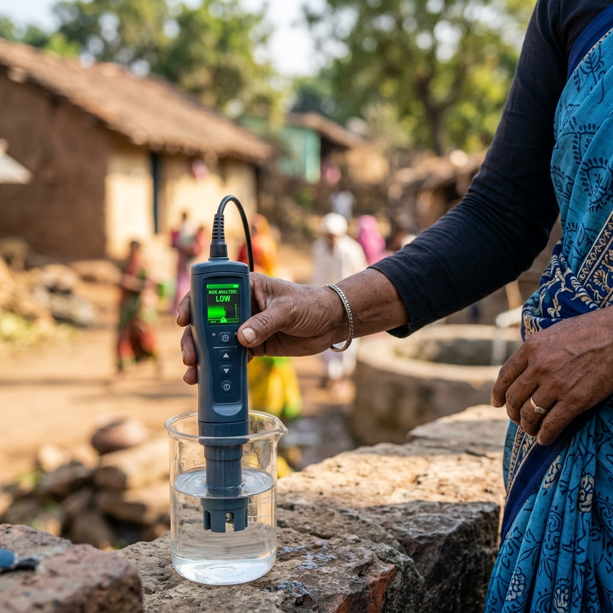

# 🛡️ Sahayogi Intelligence Platform

### **National Impact Intelligence & Community Risk Coordination**



## 📌 Vision
The **Sahayogi Intelligence Platform** is a professional "Command Center" designed for high-fidelity community risk intelligence and humanitarian coordination. Built on a robust Vite/React/TypeScript stack, it synchronizes a verified national registry of **50,000+ organizations** with real-time field intelligence to empower coordinators, volunteers, and tactical responders.

---

## ⚡ Key Intelligence Suites

### 1. **Verified National Registry**
- **50,000+ Organizations**: A curated ecosystem of NGOs, NPOs, and field volunteers.
- **Pehchaan Integration**: Deep indexing of verified impact records with high-fidelity visual documentation.
- **Dynamic Exploration**: Multi-tier filtering by region, specialty, and impact rating.

### 2. **AI-Powered Command Console (Sahayogi Bot)**
- **Gemini 2.0 Integration**: Real-time analysis of field surveys and registry data using state-of-the-art LLMs.
- **Intelligence Briefings**: Daily tactical summaries of resource gaps, signal drifts, and coordination successes.
- **Data Vitality Sidebar**: Real-time tracking of registry synchronization and risk report vitality.

### 3. **Tactical Surveillance & Risk Mapping**
- **Interactive India Risk Map**: Geospatial visualization of "Need Scores" and regional urgency.
- **Urgent Area Intelligence**: Staggered cards highlighting critical zones requiring immediate resource deployment.
- **Field Surveys**: Direct intake of community-level risk reports synchronized with a secure backend.

### 4. **Standardized Identity Ecosystem**
- **Professional Proofing**: Automated generation of digital "Field Identity Proofs" for verified organizations.
- **Mission Documentation**: High-fidelity image galleries demonstrating on-ground impact.

---

## 🎨 Design & Motion Signature
The platform adheres to a **"Mission Ready"** aesthetic, inspired by high-fidelity dashboard design principles (Emil Kowalski style):
- **Smooth Motion**: System-wide transition tokens (`--ease-expo`) and staggered entry animations.
- **Vibrant Brand Fidelity**: 100% accurate brand representation for global partners (Google, GitHub, Supabase).
- **Responsive Command Interface**: Glassmorphism, premium dark-mode hero sections, and matte-finish tactical grids.

---

## 🛠️ Technology Stack
- **Frontend**: [React 19](https://react.dev/), [Vite 8](https://vitejs.dev/), [TypeScript](https://www.typescriptlang.org/)
- **Motion**: [Framer Motion](https://www.framer.com/motion/)
- **Intelligence**: [Google Gemini AI Studio](https://aistudio.google.com/)
- **Database**: [Supabase](https://supabase.com/) (Real-time Sync & Auth)
- **Styling**: Vanilla CSS with modern Flex/Grid and Custom Motion Tokens.

---

## 🚀 Getting Started

### 1. Prerequisites
- Node.js (v18+)
- npm / yarn
- Supabase Project & Google Gemini API Key

### 2. Installation
```bash
git clone https://github.com/your-org/sahayogi-platform
cd sahayogi-platform
npm install
```

### 3. Environment Configuration
Create a `.env` file in the root:
```env
VITE_SUPABASE_URL=your_supabase_url
VITE_SUPABASE_ANON_KEY=your_supabase_key
VITE_GEMINI_API_KEY=your_gemini_api_key
```

### 4. Deployment
```bash
npm run dev    # Start Development Server
npm run build  # Production Build
```

---

## 📂 Project Architecture
The platform follows a professional modular architecture:
- `src/components`: Centralized UI components (exported via `index.ts`).
- `src/pages`: Application routes (Home, Dashboard, Explore, etc.).
- `src/lib`: Core infrastructure (Supabase, Image Resolution, AI Engine).
- `src/types`: Standardized TypeScript interfaces for NGOs and Volunteers.
- `src/data`: Bulk datasets including the 50,000+ record registry.

---

## 🛡️ Ethical Mission Statement
Sahayogi is designed strictly for **Humanitarian Coordination and Community Protection**. Use of this data is governed by the principles of privacy, accuracy, and the protection of vulnerable populations.

**Mission Ready. Community First.**
